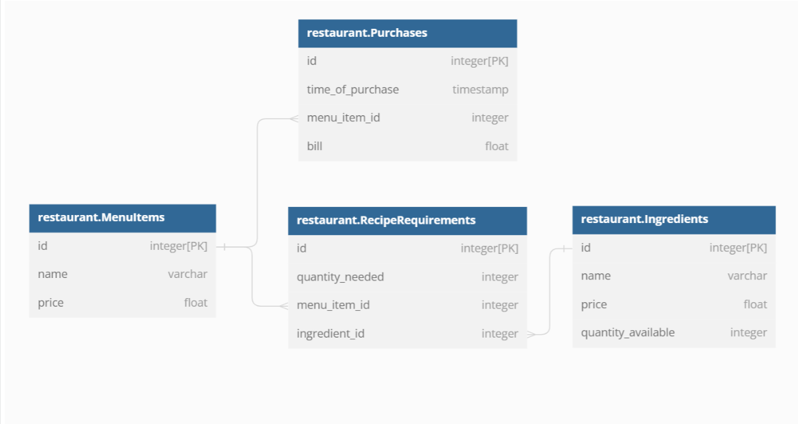
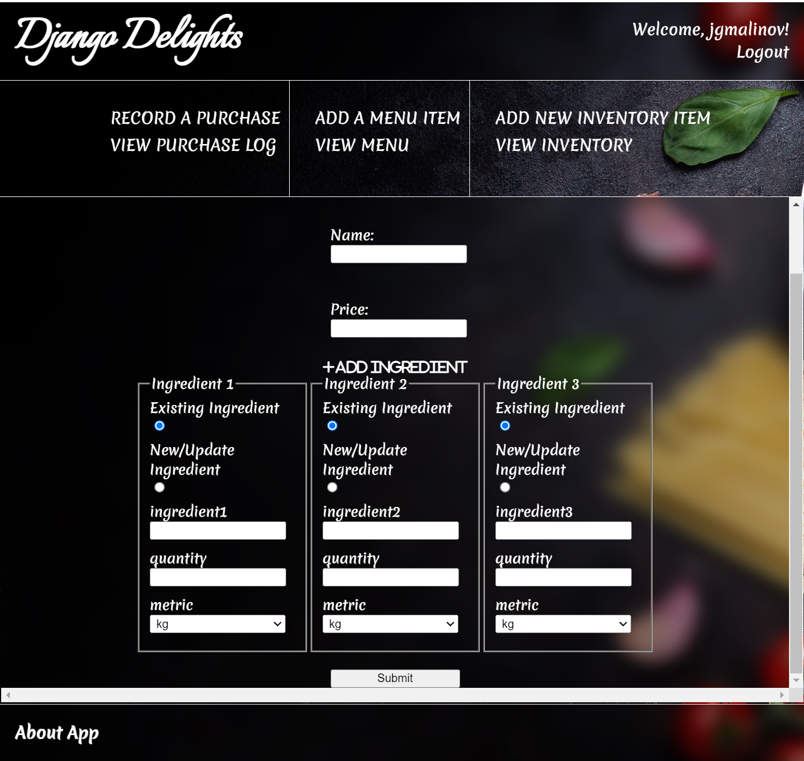

# [Django Delights](https://django-delights-restaurant-app.herokuapp.com/)
## Test credentials:
- email: **Test**
- password: **Test!234**

The app is currently deployed on Heroku. To open it, please click on the heading or find it at the following URL:  
**https://django-delights-restaurant-app.herokuapp.com/**

***

# Project Overview
Django Delights is a web application that utilizes the Django framework with its default SQLite database solution. It is the final project required for the completion of the Build Python Web Apps with Django Codecademy skill path. Its purpose is to represent a restaurant management software, allowing the end user to:

- Modify the restaurant's menu
- Restock the inventory
- Record the restaurant customers' purchases
- View the current status of the menu, inventory and purchase log, expenses, revenue and net profit 
***

# Project Development Status
The app is largely complete, with only minor potential amendments and fixes to be expected.

***

# Database Schema

***

# In-app images

***

# Local Installation and Usage
The most recent version will always be available on Heroku at the link above, but if you would like to run or review the project locally, please follow the steps below:  

## Requirements
- ***Python*** and ***Pip*** global installations are required, and a ***Python virtual environment*** is recommended so as to isolate the app's dependencies from your base Python installation. In order to set up a virtual environment at your destination of choice, you can run the following command: 

***python3 -m venv /path/to/new/virtual/environment***

Since the process of setting up a virtual environment (venv) varies slightly depending on PATH configuration and underlying operating system, please consult [the Python docs](https://docs.python.org/3/library/venv.html) if in need of further instructions.

After the requirements have been set up, please follow the instructions below:

1. Clone this repository. 
2. Activate the virtual environment with ***$ source <venv>/bin/activate***
3. Install dependencies with ***pip install -r requirements.txt***
4. Migrate the database - ***python manage.py migrate***
4. Run the app with **python manage.py runserver**
5. View the app at **http://localhost:8000/**

***

